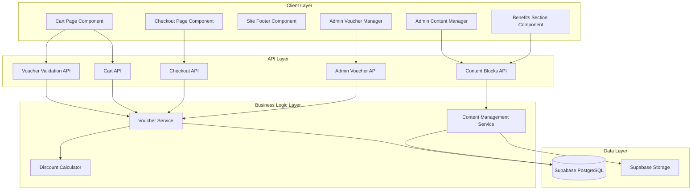

# Technical Design Document

## Overview

This document outlines the technical design for implementing a voucher discount system at checkout, administrative voucher management, footer contact updates, and multi-image carousel functionality for the "Why Choose Us" section. The design integrates with the existing MoonStrike e-commerce platform built on Next.js 14, React, TypeScript, Supabase (PostgreSQL), and Stripe.

The voucher system enables promotional discount codes that reduce cart totals at checkout, with percentage-based discounts validated against expiration dates. Admin tools provide full CRUD operations for voucher management within the existing Content section. The footer receives a Discord contact link update, and the Benefits section gains hero-carousel-style image functionality with auto-advance, manual navigation, and admin upload capabilities.

## Architecture

### System Components



### Data Flow

**Voucher Application Flow:**
1. User enters voucher code in cart page input field
2. Client sends validation request to `/api/vouchers/validate` with code
3. API validates code existence, expiration, and status
4. If valid, API returns voucher data (code, discount percentage)
5. Client stores voucher in session/state and recalculates cart totals
6. Discount displayed in order summary with original and discounted prices
7. On checkout, voucher code included in checkout session
8. Post-payment, voucher usage tracked (optional future enhancement)

**Benefits Carousel Flow:**
1. Admin uploads multiple images through Content section UI
2. Images stored in Supabase Storage with thumbnails generated
3. Image metadata (URLs, order) saved to `landing_content` table JSONB data field
4. Client fetches active benefits block with image array
5. Component renders carousel with auto-advance and navigation controls
6. User can manually navigate or let auto-advance cycle images

### Integration Points

- **Cart System**: Voucher input and discount display integrate with existing `CartPageClient`
- **Checkout System**: Voucher code passed to Stripe checkout session metadata
- **Admin CMS**: Voucher manager added to existing Content section alongside hero banners
- **Landing CMS**: Benefits carousel reuses hero banner carousel patterns
- **Footer**: Discord link added to existing social links structure

## Components and Interfaces

### Frontend Components

#### VoucherInput Component
**Location**: `components/cart/voucher-input.tsx`

```typescript
interface VoucherInputProps {
  onVoucherApplied: (voucher: AppliedVoucher) => void;
  onVoucherRemoved: () => void;
  currency: "USD" | "EUR";
  disabled?: boolean;
}

interface AppliedVoucher {
  code: string;
  discountPercentage: number;
}

export function VoucherInput({ onVoucherApplied, onVoucherRemoved, currency, disabled }: VoucherInputProps) {
  // Input field for voucher code
  // "Apply" button to validate
  // Display success message with discount percentage
  // Display error message for invalid/expired codes
  // "Remove" button to clear applied voucher
}
```

**Design**:
- Single-line text input with uppercase transformation
- "Apply" button to trigger validation
- Success state: Green checkmark icon + "X% discount applied" + "Remove" link
- Error state: Red error message below input
- Loading state: Disabled input with spinner on button

#### OrderSummary Component Enhancement
**Location**: `components/order-summary.tsx` (existing component)

**Enhancement**: Add optional voucher discount row

```typescript
interface OrderSummaryProps {
  // ... existing props
  voucher?: {
    code: string;
    discountAmount: number;
    discountPercentage: number;
  };
}
```

**Display**:
- Subtotal row (existing)
- **Voucher discount row**: "Discount (CODE: XX%)" with negative amount in green
- Total row with final discounted price in larger, bold font

#### BenefitsCarousel Component
**Location**: `components/benefits-carousel.tsx`

```typescript
interface BenefitsImage {
  imageUrl: string;
  thumbnailUrl: string;
  storagePath: string;
  thumbnailPath: string;
  displayOrder: number;
}

interface BenefitsCarouselProps {
  images: BenefitsImage[];
  alt: string;
}

export function BenefitsCarousel({ images, alt }: BenefitsCarouselProps) {
  // Carousel wrapper with relative positioning
  // Current image display with fade transitions
  // Left/right navigation arrows (if > 1 image)
  // Dot indicators at bottom (if > 1 image)
  // Auto-advance every 6 seconds
  // Pause on hover
  // Reset timer on manual navigation
}
```

**Design Pattern**: Reuses `HeroCarousel` component patterns
- No preview sidebar (unlike hero carousel)
- Same navigation button styling
- Same dot indicator styling
- Same auto-advance logic (6s interval)
- Same hover-pause behavior

#### AdminVoucherManager Component
**Location**: `app/admin/content/voucher-manager.tsx`

```typescript
interface VoucherRow {
  id: string;
  code: string;
  discountPercentage: number;
  expiresAt: string;
  status: "active" | "expired";
  createdBy: string;
  createdAt: string;
}

export function AdminVoucherManager() {
  // Table displaying all vouchers
  // "Create Voucher" button
  // Edit/Delete actions per row
  // Create/Edit modal with form
  // Confirmation dialog for delete
}
```

**Features**:
- Voucher list table with columns: Code, Discount %, Expires At, Status, Actions
- Status badge: Green "Active" or Gray "Expired"
- Create button opens modal form
- Form fields: Code (text), Discount % (number 0-100), Expiration Date (datetime picker)
- Form validation: Required fields, discount range check, duplicate code check
- Edit preserves code but allows updating discount and expiration
- Delete requires confirmation
- Success/error toasts for all operations

#### SiteFooter Component Enhancement
**Location**: `components/site-footer.tsx` (existing component)

**Enhancement**: Add Discord contact link

**Change**: Update Contact Us section to include Discord link
```typescript
// Add Discord entry to contact section
<p className="flex items-center gap-2">
  <FontAwesomeIcon icon={faDiscord} className="h-4 w-4" />
  <span className="hover:text-[var(--ms-gradient-end)] transition-colors">
    moonstrike.pro
  </span>
</p>
```

**Design**: Static text display (not clickable link) showing "moonstrike.pro" with Discord icon, consistent with phone/email styling

### Backend APIs

#### POST /api/vouchers/validate
**Purpose**: Validate voucher code and return discount details

**Request**:
```typescript
{
  code: string; // Voucher code (case-insensitive)
}
```

**Response** (Success 200):
```typescript
{
  code: string;
  discountPercentage: number;
}
```

**Response** (Error 400):
```typescript
{
  error: "Voucher code not found" | "Voucher has expired" | "Invalid voucher code";
}
```

**Logic**:
1. Trim and uppercase code
2. Query `vouchers` table for matching code
3. If not found, return 400 "not found"
4. Check `expires_at` against current timestamp
5. If expired, return 400 "expired"
6. Return voucher data

#### Admin Voucher APIs

**GET /api/admin/vouchers**
- Returns all vouchers with status computed from expiration
- Requires admin authentication
- Sorted by `created_at DESC`

**POST /api/admin/vouchers**
- Creates new voucher
- Validates: code uniqueness, discount range (0-100), expiration date
- Requires admin authentication
- Returns created voucher

**PATCH /api/admin/vouchers/[id]**
- Updates discount percentage and expiration date (code immutable)
- Validates: discount range, expiration date
- Requires admin authentication
- Returns updated voucher

**DELETE /api/admin/vouchers/[id]**
- Hard deletes voucher record
- Requires admin authentication
- Returns success confirmation

#### Content Blocks API Enhancement
**Location**: Existing `/api/admin/content/blocks/[id]` endpoints

**Enhancement**: Support array of images in benefits_section data field

**Updated Benefits Data Schema**:
```typescript
{
  title: string;
  accent: string;
  imageUrl: string; // Deprecated but kept for backward compatibility
  thumbnailUrl: string; // Deprecated
  storagePath: string; // Deprecated
  thumbnailPath: string; // Deprecated
  images: Array<{
    imageUrl: string;
    thumbnailUrl: string;
    storagePath: string;
    thumbnailPath: string;
    displayOrder: number;
  }>; // New: multiple images for carousel
  imageAlt: string;
  items: Array<LandingBenefitItem>;
}
```

**Migration Strategy**:
- If `images` array exists and has items, use it for carousel
- If `images` array empty/missing but `imageUrl` exists, render as single image (legacy)
- If neither exists, show placeholder

### Service Layer

#### VoucherService
**Location**: `lib/vouchers/service.ts`

```typescript
export interface Voucher {
  id: string;
  code: string;
  discountPercentage: number;
  expiresAt: string;
  createdBy: string;
  createdAt: string;
}

export interface VoucherWithStatus extends Voucher {
  status: "active" | "expired";
}

export async function validateVoucherCode(code: string): Promise<Voucher | null> {
  // Query database for voucher by code (case-insensitive)
  // Check expiration
  // Return voucher or null
}

export async function listVouchers(): Promise<VoucherWithStatus[]> {
  // Query all vouchers
  // Compute status based on expiration
  // Return array
}

export async function createVoucher(data: {
  code: string;
  discountPercentage: number;
  expiresAt: string;
  createdBy: string;
}): Promise<Voucher> {
  // Validate inputs
  // Check code uniqueness
  // Insert into database
  // Return created voucher
}

export async function updateVoucher(id: string, data: {
  discountPercentage: number;
  expiresAt: string;
}): Promise<Voucher> {
  // Validate inputs
  // Update database record
  // Return updated voucher
}

export async function deleteVoucher(id: string): Promise<void> {
  // Delete from database
}
```

#### DiscountCalculator
**Location**: `lib/vouchers/calculator.ts`

```typescript
export function calculateDiscount(
  subtotal: number,
  discountPercentage: number
): number {
  // Calculate: subtotal × (discountPercentage ÷ 100)
  // Round to 2 decimal places
  // Return discount amount
}

export function calculateTotal(
  subtotal: number,
  discountPercentage: number
): number {
  // Calculate: subtotal - discount
  // Round to 2 decimal places
  // Return final total
}

export interface PriceBreakdown {
  subtotal: number;
  discount: number;
  total: number;
  currency: "USD" | "EUR";
  voucherCode?: string;
  discountPercentage?: number;
}

export function computePriceBreakdown(
  subtotal: number,
  currency: "USD" | "EUR",
  voucher?: { code: string; discountPercentage: number }
): PriceBreakdown {
  // Compute all price components
  // Return breakdown object
}
```

## Data Models

### Database Schema

#### Vouchers Table
**Table Name**: `vouchers`

```sql
CREATE TABLE vouchers (
  id UUID PRIMARY KEY DEFAULT gen_random_uuid(),
  code TEXT NOT NULL UNIQUE,
  discount_percentage NUMERIC(5,2) NOT NULL 
    CHECK (discount_percentage >= 0 AND discount_percentage <= 100),
  expires_at TIMESTAMPTZ NOT NULL,
  created_by UUID NOT NULL REFERENCES admin_users(id) ON DELETE RESTRICT,
  created_at TIMESTAMPTZ NOT NULL DEFAULT NOW(),
  updated_at TIMESTAMPTZ NOT NULL DEFAULT NOW()
);

CREATE INDEX idx_vouchers_code ON vouchers (UPPER(code));
CREATE INDEX idx_vouchers_expires_at ON vouchers (expires_at);

-- RLS Policies
ALTER TABLE vouchers ENABLE ROW LEVEL SECURITY;

CREATE POLICY "service_role_manage_vouchers"
ON vouchers FOR ALL
USING (auth.role() = 'service_role')
WITH CHECK (auth.role() = 'service_role');
```

**Columns**:
- `id`: Primary key UUID
- `code`: Unique voucher code (text, case-insensitive uniqueness via UPPER index)
- `discount_percentage`: Percentage discount (0-100, stored as NUMERIC(5,2) for precision)
- `expires_at`: Expiration timestamp (TIMESTAMPTZ)
- `created_by`: Foreign key to admin_users
- `created_at`: Creation timestamp
- `updated_at`: Last update timestamp (triggers on update)

**Constraints**:
- UNIQUE constraint on `code` (case-insensitive via functional index)
- CHECK constraint on `discount_percentage` range (0-100)
- NOT NULL on all columns

**Indexes**:
- Primary key index on `id`
- Functional index on `UPPER(code)` for case-insensitive lookups
- Index on `expires_at` for expiration queries

#### Content Blocks Table Enhancement
**Table Name**: `content_blocks` (existing)

**No schema changes needed** - the `data` column is already JSONB and can store arrays.

**Benefits Section Data Structure** (stored in `data` column):
```json
{
  "title": "Why Choose Us",
  "accent": "Choose Us",
  "imageUrl": "",
  "thumbnailUrl": "",
  "storagePath": "",
  "thumbnailPath": "",
  "images": [
    {
      "imageUrl": "https://...",
      "thumbnailUrl": "https://...",
      "storagePath": "benefits/uuid-image1.jpg",
      "thumbnailPath": "benefits/uuid-image1-thumb.jpg",
      "displayOrder": 0
    },
    {
      "imageUrl": "https://...",
      "thumbnailUrl": "https://...",
      "storagePath": "benefits/uuid-image2.jpg",
      "thumbnailPath": "benefits/uuid-image2-thumb.jpg",
      "displayOrder": 1
    }
  ],
  "imageAlt": "Moon Strike benefits preview",
  "items": [...]
}
```

**Migration Plan**: Add `images` array to existing benefits_section records via data migration script

### TypeScript Interfaces

#### Voucher Types
**Location**: `lib/vouchers/types.ts`

```typescript
export interface Voucher {
  id: string;
  code: string;
  discountPercentage: number;
  expiresAt: string; // ISO timestamp
  createdBy: string;
  createdAt: string; // ISO timestamp
  updatedAt: string; // ISO timestamp
}

export interface VoucherWithStatus extends Voucher {
  status: "active" | "expired";
}

export interface CreateVoucherInput {
  code: string;
  discountPercentage: number;
  expiresAt: string;
}

export interface UpdateVoucherInput {
  discountPercentage: number;
  expiresAt: string;
}

export interface ValidateVoucherResponse {
  code: string;
  discountPercentage: number;
}

export interface AppliedVoucher {
  code: string;
  discountPercentage: number;
}
```

#### Benefits Carousel Types
**Location**: `lib/cms/landing.ts` (enhancement)

```typescript
export interface BenefitsImage {
  imageUrl: string;
  thumbnailUrl: string;
  storagePath: string;
  thumbnailPath: string;
  displayOrder: number;
}

export interface LandingBenefitsData {
  title: string;
  accent: string;
  imageUrl: string; // Legacy - kept for backward compatibility
  thumbnailUrl: string; // Legacy
  storagePath: string; // Legacy
  thumbnailPath: string; // Legacy
  images: BenefitsImage[]; // New - array for carousel
  imageAlt: string;
  items: LandingBenefitItem[];
}
```

### Cart Session Enhancement

**Current State Management**: Cart state managed via API and client-side React state

**Voucher State Addition**:
```typescript
interface CartState {
  items: CartApiItem[];
  voucher?: AppliedVoucher;
  // ... other state
}
```

**Storage**: Store applied voucher in:
1. React state (immediate UI updates)
2. Session storage (persistence across page refreshes)
3. Passed to checkout via query param or session

**Checkout Integration**: Include voucher code in Stripe checkout session metadata
```typescript
{
  metadata: {
    voucher_code: "SUMMER20",
    discount_percentage: "20",
    // ... other metadata
  }
}
```

## Correctness Properties

*A property is a characteristic or behavior that should hold true across all valid executions of a system—essentially, a formal statement about what the system should do. Properties serve as the bridge between human-readable specifications and machine-verifiable correctness guarantees.*

### Prework Analysis

Before defining correctness properties, I'll analyze each acceptance criterion for testability:


### Property Reflection

After analyzing all acceptance criteria, I'll identify redundant properties that can be consolidated:

**Redundancy Analysis:**

1. **Discount Calculation Properties (2.1, 2.2, 2.3)**: These three properties test the same calculation logic for different currencies. Property 2.1 (core formula) combined with currency-specific handling can be consolidated into a single comprehensive property.

2. **Validation Properties (3.1, 3.2, 3.3, 3.4, 3.5)**: Properties 3.3 and 3.4 are specific error cases already covered by 3.1 and 3.2. Property 3.5 (error messages) is orthogonal and should remain separate.

3. **Voucher Display Properties (1.3, 1.4, 2.5)**: These overlap significantly - if we verify the order summary displays all three components (subtotal, discount, total) correctly with various inputs, we cover all three requirements.

4. **Admin CRUD Properties (4.2, 4.7) and (4.3, 4.6)**: The error display properties (4.6, 4.7) are already covered by the validation properties (4.2, 4.3).

5. **Carousel Navigation Properties (7.3, 7.4, 7.5, 7.6)**: These can be consolidated into comprehensive carousel behavior properties.

**Consolidated Property List:**
- Voucher validation logic (covers 1.2, 3.1, 3.2, 3.5)
- Discount calculation across currencies (covers 2.1, 2.2, 2.3, 2.4)
- Order summary display (covers 1.3, 1.4, 2.5)
- Session persistence (1.6)
- Cross-page voucher transfer (1.7)
- Admin voucher creation validation (covers 4.2, 4.3, 4.4, 4.5)
- Admin voucher editing constraints (covers 5.3, 5.4)
- Admin voucher deletion (5.5)
- Status computation (5.6)
- Carousel multi-image upload (7.1, 8.2)
- Carousel auto-advance behavior (7.4, 7.5, 7.6)
- Carousel image management (8.1, 8.3, 8.4)
- Thumbnail generation (7.7)

### Property 1: Voucher Validation Logic

*For any* voucher code input, the validation system SHALL return success with discount data if the code exists in the database and has not expired, OR SHALL return a specific error message indicating either "not found" or "expired" based on the failure reason.

**Validates: Requirements 1.2, 3.1, 3.2, 3.5**

### Property 2: Discount Calculation Accuracy

*For any* cart subtotal amount and discount percentage (0-100), the discount calculation SHALL produce an amount equal to (subtotal × percentage ÷ 100) rounded to exactly two decimal places, and this calculation SHALL work correctly for both USD and EUR currencies independently.

**Validates: Requirements 2.1, 2.2, 2.3, 2.4**

### Property 3: Order Summary Display Completeness

*For any* valid voucher application, the order summary SHALL display all three required components: the original subtotal, the discount amount (as a negative or clearly marked reduction), and the final discounted total, with each value formatted correctly for the active currency.

**Validates: Requirements 1.3, 1.4, 2.5**

### Property 4: Voucher Session Persistence

*For any* valid voucher applied during a user session, the voucher SHALL remain active and continue to apply the discount across page refreshes, navigation within the cart/checkout flow, and other session operations until explicitly removed by the user or session expiration.

**Validates: Requirements 1.6**

### Property 5: Cross-Page Voucher Transfer

*For any* voucher successfully applied on the cart page, when the user navigates to the checkout page, the checkout page SHALL display the same voucher discount with the same discount amount and percentage.

**Validates: Requirements 1.7**

### Property 6: Admin Voucher Creation Validation

*For any* voucher creation attempt, the system SHALL enforce all validation rules: code uniqueness (rejecting duplicates), discount percentage range (0-100), and required expiration date, successfully creating and persisting the voucher to the database only when all validations pass.

**Validates: Requirements 4.2, 4.3, 4.4, 4.5**

### Property 7: Admin Voucher Code Immutability

*For any* existing voucher, when an administrator attempts to edit the voucher, the system SHALL allow modification of discount percentage and expiration date BUT SHALL prevent any modification to the voucher code field.

**Validates: Requirements 5.3, 5.4**

### Property 8: Admin Voucher Deletion Completeness

*For any* voucher selected for deletion, the deletion operation SHALL completely remove the voucher record from the database such that subsequent queries for that voucher code return no results.

**Validates: Requirements 5.5**

### Property 9: Voucher Status Computation

*For any* voucher record, the displayed status SHALL be "active" if the current timestamp is before the expiration date, OR "expired" if the current timestamp is at or after the expiration date, with status computed dynamically on each display.

**Validates: Requirements 5.6**

### Property 10: Carousel Multi-Image Upload

*For any* set of valid image files uploaded to the benefits section, the system SHALL accept all images, store them in Supabase Storage, generate thumbnails for each, save metadata to the database with correct display order, and make all images available in the carousel.

**Validates: Requirements 7.1, 7.7, 8.2**

### Property 11: Carousel Auto-Advance Behavior

*For any* benefits carousel with more than one image, the carousel SHALL automatically advance to the next image after exactly 6 seconds, pause auto-advance when the user hovers over the carousel, resume auto-advance when hover ends, and reset the 6-second timer to zero whenever the user manually navigates to a different image.

**Validates: Requirements 7.4, 7.5, 7.6**

### Property 12: Carousel Image Management

*For any* benefits carousel image collection, administrators SHALL be able to view all uploaded images, add new images to the collection, delete existing images (removing both database records and storage files), and reorder images with the new order persisting and reflecting in the public carousel display.

**Validates: Requirements 8.1, 8.3, 8.4**

### Property 13: Invalid Voucher Error Display

*For any* invalid voucher submission (non-existent code or expired code), the system SHALL display a user-visible error message immediately below the voucher input field, preventing the voucher from being applied to the cart total.

**Validates: Requirements 1.5**

### Property 14: Carousel Navigation Visibility

*For any* benefits carousel, navigation arrows and dot indicators SHALL be visible and functional when the carousel contains more than one image, AND SHALL be hidden when the carousel contains zero or one image.

**Validates: Requirements 7.3, 8.6**

## Error Handling

### Voucher Validation Errors

**Scenarios**:
1. Voucher code not found in database
2. Voucher code expired
3. Network error during validation API call
4. Malformed voucher code (empty, whitespace-only, too long)
5. Database query timeout

**Handling Strategy**:
- Display user-friendly error messages below input field
- Distinguish between "not found" and "expired" messages
- Show generic "Unable to validate voucher" for network/system errors
- Clear previous error messages on new input
- Log server-side errors for monitoring
- Prevent form submission when validation fails

**Error Messages**:
- "Voucher code not found" - Code doesn't exist
- "This voucher has expired" - Expiration date passed
- "Unable to validate voucher. Please try again." - Network/system errors
- "Please enter a voucher code" - Empty input

### Discount Calculation Errors

**Scenarios**:
1. Invalid discount percentage (< 0 or > 100)
2. Invalid subtotal amount (negative or NaN)
3. Currency mismatch between cart and voucher
4. Rounding precision issues

**Handling Strategy**:
- Validate discount percentage at database constraint level
- Validate subtotal before calculation (reject negative/NaN)
- Always calculate discounts for both USD and EUR
- Use `Number.toFixed(2)` for consistent rounding
- Log unexpected calculation errors
- Fallback to showing cart without discount on calculation failure

### Admin Voucher Management Errors

**Scenarios**:
1. Duplicate voucher code on creation
2. Discount percentage out of range (0-100)
3. Missing required fields (code, discount, expiration)
4. Past expiration date on creation
5. Network error during save
6. Permission denied (non-admin user)

**Handling Strategy**:
- Client-side validation before API call
- Server-side validation with specific error messages
- Display validation errors inline on form fields
- Show toast notification on successful save
- Show error toast on network/permission failures
- Rollback UI state on save failure
- Require confirmation dialog for delete operations

**Error Messages**:
- "This voucher code already exists" - Duplicate code
- "Discount must be between 0 and 100" - Range error
- "All fields are required" - Missing fields
- "Expiration date must be in the future" - Past date warning
- "Unable to save voucher. Please try again." - Network error

### Image Upload Errors

**Scenarios**:
1. File too large (> 10MB)
2. Invalid file type (not image)
3. Storage quota exceeded
4. Network error during upload
5. Thumbnail generation failure
6. Duplicate image (same file hash)

**Handling Strategy**:
- Client-side file validation before upload
- Show upload progress indicator
- Display error message on upload failure
- Allow retry on network errors
- Fall back to original image if thumbnail fails
- Prevent duplicate uploads with file hash check
- Show inline error on specific image upload failure (not block entire form)

**Error Messages**:
- "Image must be under 10MB" - Size error
- "Only image files are allowed" - Type error
- "Storage limit reached. Please delete old images." - Quota error
- "Upload failed. Please try again." - Network error

### Carousel Display Errors

**Scenarios**:
1. Image URL returns 404
2. Image fails to load
3. No images in carousel
4. Auto-advance timer error
5. Navigation index out of bounds

**Handling Strategy**:
- Display placeholder for failed image loads
- Show default placeholder if no images exist
- Validate navigation index bounds before transition
- Gracefully handle timer failures (disable auto-advance)
- Log client-side errors for monitoring
- Ensure carousel always shows *something* (never blank)

## Testing Strategy

### Unit Testing

**Voucher Discount Calculator** (`lib/vouchers/calculator.ts`):
- Test discount calculation with various subtotals and percentages
- Test rounding to 2 decimal places
- Test edge cases: 0% discount, 100% discount, 0 subtotal
- Test both USD and EUR calculations independently
- Test total calculation (subtotal - discount)

**Voucher Validation Service** (`lib/vouchers/service.ts`):
- Test validation with existing codes
- Test validation with non-existent codes
- Test expiration checking with past/future dates
- Test case-insensitive code matching
- Mock database for isolation

**Admin Voucher CRUD** (`lib/vouchers/service.ts`):
- Test voucher creation with valid data
- Test uniqueness constraint (duplicate codes)
- Test discount range validation (0-100)
- Test required field validation
- Test update operations
- Test delete operations
- Test status computation with various expiration dates

**Benefits Carousel Component** (`components/benefits-carousel.tsx`):
- Test rendering with 0, 1, and multiple images
- Test navigation arrow visibility (hidden for 0-1 images)
- Test manual navigation (prev/next buttons)
- Test dot indicator clicks
- Test auto-advance timer (mock timers)
- Test hover pause behavior
- Test timer reset on manual navigation

**Order Summary Component** (`components/order-summary.tsx`):
- Test display with no voucher applied
- Test display with voucher applied
- Test voucher discount row formatting
- Test total calculation display
- Test currency formatting (USD/EUR)

### Property-Based Testing

Property-based testing is appropriate for this feature since we're testing pure functions (discount calculation), validation logic, and state management that should hold across a wide range of inputs.

**Library**: fast-check (TypeScript/JavaScript PBT library)

**Configuration**: Minimum 100 iterations per property test

**Property Test 1: Discount Calculation Accuracy**
```typescript
// Test that discount calculation always produces (subtotal * percentage / 100) rounded to 2 decimals
fc.assert(
  fc.property(
    fc.double({ min: 0, max: 100000, noNaN: true }), // subtotal
    fc.integer({ min: 0, max: 100 }), // discount percentage
    fc.constantFrom("USD", "EUR"), // currency
    (subtotal, percentage, currency) => {
      const discount = calculateDiscount(subtotal, percentage);
      const expected = Number((subtotal * percentage / 100).toFixed(2));
      return Math.abs(discount - expected) < 0.01; // floating point tolerance
    }
  ),
  { numRuns: 100 }
);
// Feature: voucher-and-content-updates, Property 2: Discount calculation accuracy
```

**Property Test 2: Voucher Validation Logic**
```typescript
// Test that validation returns correct result based on code existence and expiration
fc.assert(
  fc.property(
    fc.record({
      code: fc.string({ minLength: 1, maxLength: 20 }).map(s => s.toUpperCase()),
      exists: fc.boolean(),
      expiresAt: fc.date(),
    }),
    async ({ code, exists, expiresAt }) => {
      // Mock database with code existing or not
      const result = await validateVoucherCode(code);
      const now = new Date();
      
      if (!exists) {
        return result === null;
      }
      if (expiresAt < now) {
        return result === null;
      }
      return result !== null && result.code === code;
    }
  ),
  { numRuns: 100 }
);
// Feature: voucher-and-content-updates, Property 1: Voucher validation logic
```

**Property Test 3: Order Summary Display Completeness**
```typescript
// Test that order summary always displays all three components when voucher applied
fc.assert(
  fc.property(
    fc.double({ min: 1, max: 100000, noNaN: true }), // subtotal
    fc.integer({ min: 1, max: 100 }), // discount percentage (non-zero)
    fc.string({ minLength: 4, maxLength: 20 }), // voucher code
    (subtotal, percentage, code) => {
      const breakdown = computePriceBreakdown(subtotal, "USD", { code, discountPercentage: percentage });
      return (
        breakdown.subtotal > 0 &&
        breakdown.discount > 0 &&
        breakdown.total >= 0 &&
        breakdown.subtotal > breakdown.total &&
        breakdown.voucherCode === code
      );
    }
  ),
  { numRuns: 100 }
);
// Feature: voucher-and-content-updates, Property 3: Order summary display completeness
```

**Property Test 4: Admin Voucher Creation Validation**
```typescript
// Test that voucher creation enforces all validation rules
fc.assert(
  fc.property(
    fc.record({
      code: fc.string({ minLength: 0, maxLength: 50 }),
      discount: fc.double({ min: -10, max: 110, noNaN: true }),
      expiresAt: fc.option(fc.date()),
    }),
    async ({ code, discount, expiresAt }) => {
      const result = await createVoucher({ code, discountPercentage: discount, expiresAt, createdBy: "test-admin" });
      
      const isValid = 
        code.trim().length > 0 &&
        discount >= 0 && discount <= 100 &&
        expiresAt !== null;
      
      if (isValid) {
        return result !== null;
      } else {
        return result === null; // Should reject invalid inputs
      }
    }
  ),
  { numRuns: 100 }
);
// Feature: voucher-and-content-updates, Property 6: Admin voucher creation validation
```

**Property Test 5: Voucher Status Computation**
```typescript
// Test that status is correctly computed based on expiration date
fc.assert(
  fc.property(
    fc.date(), // expiration date
    (expiresAt) => {
      const now = new Date();
      const status = computeVoucherStatus(expiresAt);
      
      if (expiresAt < now) {
        return status === "expired";
      } else {
        return status === "active";
      }
    }
  ),
  { numRuns: 100 }
);
// Feature: voucher-and-content-updates, Property 9: Voucher status computation
```

### Integration Testing

**Voucher End-to-End Flow**:
1. Create voucher via admin API
2. Apply voucher on cart page
3. Verify discount calculated and displayed
4. Navigate to checkout
5. Verify voucher persists and discount shows
6. Complete checkout with voucher applied
7. Verify order includes voucher discount

**Benefits Carousel End-to-End Flow**:
1. Upload multiple images via admin UI
2. Verify images saved to Supabase Storage
3. Verify thumbnails generated
4. Verify metadata saved to database
5. Load landing page
6. Verify carousel displays all images
7. Verify auto-advance works
8. Verify manual navigation works
9. Delete image via admin UI
10. Verify image removed from storage and database

**Admin Voucher Management Flow**:
1. Login as admin
2. Navigate to Content > Voucher Management
3. Create new voucher
4. Verify voucher appears in list
5. Edit voucher discount and expiration
6. Verify changes saved
7. Delete voucher
8. Verify voucher removed from list

### Manual Testing

**UI/UX Testing**:
- Verify voucher input styling matches design system
- Verify error messages are user-friendly and clear
- Verify order summary layout is responsive
- Verify carousel transitions are smooth
- Verify navigation controls are accessible
- Verify admin forms are intuitive

**Cross-Browser Testing**:
- Test on Chrome, Firefox, Safari, Edge
- Test on mobile browsers (iOS Safari, Chrome Mobile)
- Verify carousel auto-advance works consistently
- Verify form validation works across browsers

**Accessibility Testing**:
- Verify voucher input has proper ARIA labels
- Verify error messages announced to screen readers
- Verify carousel controls keyboard navigable
- Verify focus management in admin forms
- Test with screen reader (NVDA/JAWS)

### Database Testing

**Schema Validation**:
- Verify vouchers table created with correct schema
- Verify constraints enforced (unique code, discount range, NOT NULL)
- Verify indexes created for performance
- Verify RLS policies applied correctly
- Test uniqueness with case-insensitive codes (UPPER index)

**Data Migration Testing**:
- Test migration to add `images` array to existing benefits blocks
- Verify backward compatibility with single-image benefits
- Verify data integrity after migration

## Implementation Notes

### Technology Stack

- **Frontend**: Next.js 14 (App Router), React 18, TypeScript, Tailwind CSS
- **Backend**: Next.js API Routes, Server Components, Server Actions
- **Database**: Supabase (PostgreSQL), Supabase Storage (images)
- **Payments**: Stripe Checkout (voucher code in metadata)
- **Testing**: Jest, React Testing Library, fast-check (PBT), Playwright (E2E)
- **Validation**: Zod schemas for API validation

### Database Migration

**Migration File**: `supabase/migrations/YYYYMMDDHHMMSS_create_vouchers_table.sql`

```sql
-- Create vouchers table
CREATE TABLE IF NOT EXISTS vouchers (
  id UUID PRIMARY KEY DEFAULT gen_random_uuid(),
  code TEXT NOT NULL,
  discount_percentage NUMERIC(5,2) NOT NULL 
    CHECK (discount_percentage >= 0 AND discount_percentage <= 100),
  expires_at TIMESTAMPTZ NOT NULL,
  created_by UUID NOT NULL REFERENCES admin_users(id) ON DELETE RESTRICT,
  created_at TIMESTAMPTZ NOT NULL DEFAULT NOW(),
  updated_at TIMESTAMPTZ NOT NULL DEFAULT NOW()
);

-- Create unique case-insensitive index on code
CREATE UNIQUE INDEX idx_vouchers_code_unique ON vouchers (UPPER(code));

-- Create index on expires_at for expiration queries
CREATE INDEX idx_vouchers_expires_at ON vouchers (expires_at);

-- Enable RLS
ALTER TABLE vouchers ENABLE ROW LEVEL SECURITY;

-- Create policy for service role (admin operations)
CREATE POLICY "service_role_manage_vouchers"
ON vouchers FOR ALL
USING (auth.role() = 'service_role')
WITH CHECK (auth.role() = 'service_role');

-- Create trigger for updated_at
CREATE OR REPLACE FUNCTION update_updated_at_column()
RETURNS TRIGGER AS $$
BEGIN
  NEW.updated_at = NOW();
  RETURN NEW;
END;
$$ LANGUAGE plpgsql;

CREATE TRIGGER update_vouchers_updated_at
BEFORE UPDATE ON vouchers
FOR EACH ROW
EXECUTE FUNCTION update_updated_at_column();
```

### Stripe Checkout Integration

**Metadata Addition**: Include voucher data in Stripe checkout session

```typescript
// In checkout creation API
const session = await stripe.checkout.sessions.create({
  // ... existing session config
  metadata: {
    cart_id: cartId,
    user_id: userId,
    voucher_code: voucherCode, // Add voucher code
    discount_percentage: discountPercentage.toString(), // Add discount %
    // ... other metadata
  },
  line_items: [
    {
      price_data: {
        currency: currency.toLowerCase(),
        unit_amount: Math.round(discountedTotal * 100), // Apply discount to total
        product_data: {
          name: "Order Total",
          description: voucherCode ? `Includes ${discountPercentage}% discount (${voucherCode})` : undefined,
        },
      },
      quantity: 1,
    },
  ],
});
```

**Order Record**: Store voucher data in orders table (optional enhancement)

### Benefits Image Storage

**Storage Bucket**: Use existing Supabase Storage bucket for landing content

**Path Structure**: `landing-content/benefits/{uuid}-{filename}.{ext}`

**Thumbnail Generation**: Server-side thumbnail generation using Sharp library

```typescript
import sharp from 'sharp';

async function generateThumbnail(file: File): Promise<Buffer> {
  const buffer = await file.arrayBuffer();
  return await sharp(Buffer.from(buffer))
    .resize(640, 360, { fit: 'cover' })
    .jpeg({ quality: 80 })
    .toBuffer();
}
```

### Session Storage for Voucher

**Storage Key**: `moonstrike_applied_voucher`

**Storage Format**:
```json
{
  "code": "SUMMER20",
  "discountPercentage": 20,
  "appliedAt": "2026-06-15T10:30:00Z"
}
```

**Persistence Logic**:
```typescript
// Save to session storage
sessionStorage.setItem('moonstrike_applied_voucher', JSON.stringify(voucher));

// Load from session storage on page load
const savedVoucher = sessionStorage.getItem('moonstrike_applied_voucher');
if (savedVoucher) {
  const voucher = JSON.parse(savedVoucher);
  // Revalidate voucher before applying
  await validateVoucherCode(voucher.code);
}

// Clear on user action
sessionStorage.removeItem('moonstrike_applied_voucher');
```

### Security Considerations

**Voucher Code Validation**:
- Server-side validation only (never trust client)
- Rate limiting on validation endpoint (prevent brute force)
- Case-insensitive comparison (prevent duplicate codes with different casing)
- Trim whitespace from input

**Admin Authentication**:
- Require admin session for all voucher management APIs
- Verify admin permissions before allowing CRUD operations
- Log all voucher management actions to audit trail

**Discount Integrity**:
- Calculate discounts server-side only
- Verify voucher validity at checkout time (not just cart time)
- Store voucher code in Stripe metadata for reconciliation
- Prevent manual discount manipulation

**Image Upload Security**:
- Validate file types (images only)
- Limit file size (10MB max)
- Scan for malicious content (if required)
- Store with UUID filenames (prevent path traversal)
- Use signed URLs for storage access

### Performance Optimizations

**Voucher Validation**:
- Cache valid voucher codes in Redis (5-minute TTL)
- Use database index on UPPER(code) for fast lookups
- Return early on cache hit

**Carousel Images**:
- Lazy load images not currently displayed
- Preload next image in carousel sequence
- Use Next.js Image component with priority on first image
- Generate multiple thumbnail sizes for responsive display

**Admin Voucher List**:
- Paginate voucher list (50 per page)
- Index on expires_at for fast status filtering
- Compute status on client to avoid DB round trips

### Deployment Checklist

- [ ] Run database migration for vouchers table
- [ ] Update environment variables (if needed)
- [ ] Deploy voucher validation API endpoint
- [ ] Deploy admin voucher management endpoints
- [ ] Update cart page with voucher input component
- [ ] Update order summary component
- [ ] Update checkout flow to include voucher
- [ ] Update footer with Discord contact
- [ ] Deploy benefits carousel component
- [ ] Update admin content section with voucher management
- [ ] Update landing CMS for multi-image benefits
- [ ] Run integration tests on staging
- [ ] Verify Stripe metadata includes voucher data
- [ ] Test end-to-end voucher flow
- [ ] Test benefits carousel on production

### Future Enhancements

**Voucher Usage Tracking**:
- Track how many times each voucher is used
- Limit voucher to single use per user
- Add usage count column to vouchers table
- Track total discount amount provided by each voucher

**Advanced Voucher Types**:
- Minimum cart amount requirement
- Maximum discount cap (e.g., $50 max)
- Category-specific vouchers (only for certain games)
- First-time customer vouchers
- Stackable vouchers

**Benefits Carousel Enhancements**:
- Add caption/title overlay on each image
- Add CTA button on carousel images
- Link images to specific services
- Add video support (MP4 auto-play)
- Add parallax scroll effect

**Admin Improvements**:
- Bulk voucher creation (CSV import)
- Voucher analytics dashboard (usage, revenue impact)
- Scheduled voucher activation (start/end dates)
- Voucher templates for common promotions
- A/B testing different voucher strategies
